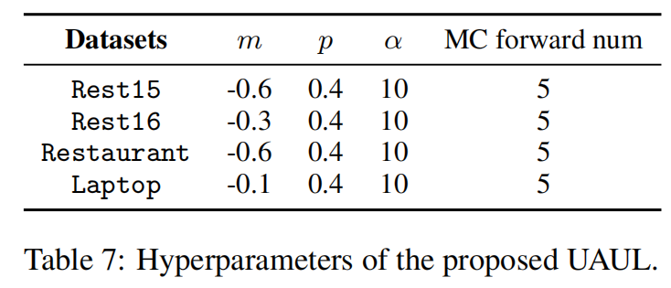

<!-- # UAUL

We are making the final preparations for the release of our data and code. They will be coming soon. -->

# Uncertainty-Aware Unlikelihood Learning Improves Generative Aspect Sentiment Quad Prediction

The contributions of this paper are as follows:

- We study generative ASQP task from the view of what not to generate. To the best of our knowledge, this is the first work to study negative samples in this task. We propose uncertainty-aware unlikelihood learning to avoid the intrinsic mistakes of pre-trained language models;
- Specifically, the model uncertainty is comprehended with MC dropout. And the built-in errors are reduced with the proposed marginalized unlikelihood learning and minimization entropy. Our method is template-agnostic and can be easily applied to various target templates;
- Experimental results on four public datasets Rest15, Rest16, Restaurant, and Laptop demonstrate that UAUL has universal effectiveness  on various templates.

## Methods

We provided the source code of uncertainty-aware unlikelihood learning (UAUL).

Overview of our Uncertainty-Aware Unlikelihood Learning method. We address "noise and errors" with an "acquire-and-reduce" method, using an uncertainty-aware negative sampling approach with Monte-Carlo Dropout (MC dropout) to obtain negative samples vulnerable to errors during training. We then propose a MUL loss to reduce these errors and noise.

<p align="center">
  
</p>
<!--  -->

## Results
The quadruple extraction performance of five different systems (including baseline and +UAUL) on the four datasets:

<p align="center">
  
</p>

<p align="center">
  
</p>

We further investigate the ability of UAUL under low resource scenario:

<p align="center">
  
</p>

## Environment
    Python==3.8
    torch==1.11.0
    transformers==4.14.1
    pytorch_lightning==0.8.1
    numpy==1.21.2
    
## Hyperparameters

<p align="center">
  
</p>

<p align="center">
  
</p>

## Citation
If you use the data and code in your research, please cite our paper as follows:
```
```
